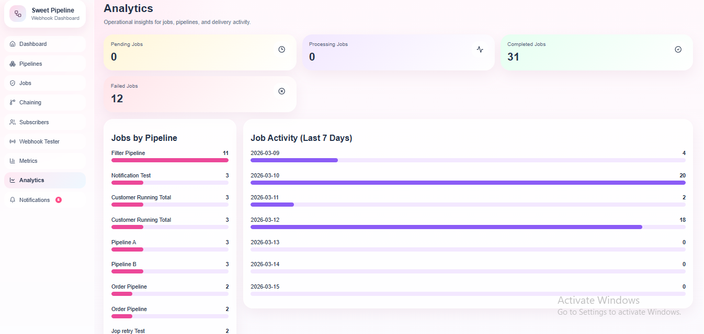

# Webhook-Driven Task Processing Pipeline

[](https://github.com/AishaRiyad/webhook-task-pipeline/actions)


A full-stack webhook processing platform that receives signed webhook events, queues them for asynchronous background processing, applies configurable pipeline actions, and delivers the results to registered subscriber endpoints.

The project includes:

- a modular TypeScript backend  
- PostgreSQL-backed job queue  
- separate processing and delivery workers  
- retry logic for jobs and deliveries  
- pipeline chaining with cycle detection  
- a React dashboard for monitoring and management  
- Docker Compose setup  
- GitHub Actions CI  
- automated tests


----------------------------------------------------------------------
## Table of Contents

- Overview
- Core Features
- Architecture
- End-to-End Processing Flow
- Tech Stack
- Project Structure
- Database Design
- Key Technical Decisions
- Reliability and Failure Handling
- Security
- API Endpoints
- Request/Response Examples
- Running with Docker
- Running Locally Without Docker
- Testing
- CI Pipeline
- Frontend Features
- Operational Notes
- Future Improvements
-Future Improvements

----------------------------------------------------------------------

## Overview

This system is designed to solve a common reliability problem in webhook-based systems:  
external services should be able to send events quickly, while internal processing and downstream deliveries should happen safely in the background.

Instead of processing an incoming webhook synchronously, the backend:

1. Verifies the webhook signature  
2. Stores the event in the database  
3. Creates a background job  
4. Returns `202 Accepted`  
5. Lets workers process and deliver the result asynchronously  

Each user can create pipelines. A pipeline consists of:

- A unique webhook source URL  
- A processing action  
- One or more subscriber endpoints  

After processing, the resulting payload is delivered to subscribers with retry logic and detailed delivery attempt logging.

The system also supports **pipeline chaining**, where the output of one pipeline can trigger another pipeline.

----------------------------------------------------------------------

## Core Features

### Pipeline Management

- Create pipelines
- List pipelines
- Get one pipeline
- Delete pipelines
- Add and remove subscribers
- Create and remove links between pipelines

### Webhook Processing

- Signed webhook ingestion
- Asynchronous processing
- Event persistence
- Job creation

### Supported Processing Actions

- Enrich
- Transform
- Filter
- Deduplicate
- Running sum

### Job System

- PostgreSQL-backed job queue
- Background job worker
- Job retry with exponential backoff
- Job status tracking

### Delivery System

- Separate delivery worker
- Multiple subscribers per pipeline
- Delivery retry with exponential backoff
- Delivery attempt logs
- Failure notifications

### Monitoring

- Jobs page
- Job details page
- Metrics dashboard
- Notifications page
- Subscribers page
- Chaining page
- Webhook tester page

### Infrastructure

- Docker Compose
- Health checks
- CI pipeline
- Frontend and backend tests


----------------------------------------------------------------------

## Architecture

The system is split into five main runtime components:

- API Server  
- PostgreSQL Database  
- Job Worker  
- Delivery Worker  
- Frontend Dashboard  


### High-level Flow

```
External Sender
   |
   v
POST /webhooks/:sourceKey
   |
   v
API Server
   |
   |-- store webhook event
   |-- create job
   |
   v
Jobs table (PostgreSQL queue)
   |
   v
Job Worker
   |
   |-- load webhook event
   |-- apply pipeline action
   |-- update job result
   |-- create delivery tasks
   |-- create chained jobs (if linked pipelines exist)
   |
   v
Job Deliveries table
   |
   v
Delivery Worker
   |
   |-- send result to subscriber URLs
   |-- retry on failure
   |-- store delivery attempt logs
   |
   v
Subscriber Endpoints
```

----------------------------------------------------------------------

## End-to-End Processing Flow

### 1. User creates a pipeline

The user creates a pipeline through the dashboard or API.

A pipeline includes:

- Pipeline name
- Action type
- Action configuration
- Optional subscriber URLs

The backend generates:

- `source_key`
- `webhook_secret`

These are used for webhook ingestion and signature verification.

---

### 2. External system sends a webhook

Webhook endpoint:

`POST /webhooks/:sourceKey`

The request must include headers:

- `x-webhook-timestamp`
- `x-webhook-signature`

The backend verifies the signature using **HMAC SHA-256** and the pipeline's secret.

---

### 3. Backend stores the event and queues a job

If the signature is valid:

- The payload is stored in `webhook_events`
- A new row is inserted into `jobs`
- The API returns `202 Accepted`

This keeps webhook ingestion **fast and safe**.

---

### 4. Job worker processes the job

The job worker:

- Selects the next available pending job using row locking
- Loads the webhook event
- Loads the pipeline configuration
- Applies the configured action
- Stores the final `result_payload`
- Creates delivery rows for subscribers
- Creates chained jobs for downstream pipelines

---

### 5. Delivery worker sends the processed result

For each delivery:

- Send HTTP `POST` to subscriber URL
- Record the attempt
- Update delivery status
- Retry if needed
- Mark final failure after max attempts

---

### 6. User monitors everything in the dashboard

The frontend dashboard allows the user to:

- Inspect pipeline definitions
- Inspect jobs
- Inspect delivery attempts
- Inspect metrics
- Receive notifications
- Send test webhooks directly

---

# Tech Stack

### Backend

- Node.js
- Express
- TypeScript
- PostgreSQL
- Zod
- JWT
- bcryptjs
- Swagger

### Frontend

- React
- TypeScript
- Vite
- React Router
- Framer Motion
- Lucide Icons

### DevOps / Tooling

- Docker
- Docker Compose
- GitHub Actions
- ESLint
- Prettier
- Vitest
- Testing Library


----------------------------------------------------------------------

## Project Structure

```
.
├── backend
│   ├── src
│   │   ├── config
│   │   │   └── swagger.ts
│   │   ├── db
│   │   │   ├── database.ts
│   │   │   ├── init.ts
│   │   │   ├── initDb.ts
│   │   │   └── sql/init.sql
│   │   ├── modules
│   │   │   ├── auth
│   │   │   ├── deliveries
│   │   │   ├── jobs
│   │   │   ├── metrics
│   │   │   ├── notifications
│   │   │   ├── pipelines
│   │   │   ├── subscribers
│   │   │   └── webhooks
│   │   ├── shared
│   │   │   ├── middleware
│   │   │   └── utils
│   │   ├── worker
│   │   │   ├── worker.ts
│   │   │   └── deliveryWorker.ts
│   │   ├── app.ts
│   │   └── server.ts
│   ├── Dockerfile
│   ├── package.json
│   └── tsconfig.json
│
├── frontend
│   ├── src
│   │   ├── api
│   │   ├── components
│   │   ├── pages
│   │   ├── test
│   │   ├── types
│   │   ├── App.tsx
│   │   └── main.tsx
│   ├── Dockerfile
│   ├── nginx.conf
│   ├── package.json
│   └── vite.config.ts
│
├── .github/workflows
│   └── ci.yml
│
└── docker-compose.yml
```

----------------------------------------------------------------------

## Database Design

The database is not only used for persistence.  
It also acts as a **lightweight queueing layer** for job processing and delivery handling.

---

## Main Tables

### 1. users

Stores registered users.

**Important fields**

- `id`
- `email`
- `password_hash`

---

### 2. refresh_tokens

Stores hashed refresh tokens.

**Important fields**

- `id`
- `user_id`
- `token_hash`
- `expires_at`

---

### 3. pipelines

Stores pipeline definitions.

**Important fields**

- `id`
- `user_id`
- `name`
- `source_key`
- `webhook_secret`
- `action_type`
- `action_config`
- `is_active`

---

### 4. pipeline_links

Stores pipeline chaining links.

**Important fields**

- `source_pipeline_id`
- `target_pipeline_id`

**Constraints**

- Unique source–target pair
- No self-loop at database level

---

### 5. pipeline_subscribers

Stores subscriber endpoints.

**Important fields**

- `pipeline_id`
- `target_url`
- `is_active`

---

### 6. webhook_events

Stores all received webhook requests.

**Important fields**

- `pipeline_id`
- `headers`
- `payload`

---

### 7. jobs

Acts as the **processing queue**.

**Important fields**

- `pipeline_id`
- `webhook_event_id`
- `status`
- `attempts`
- `max_attempts`
- `available_at`
- `started_at`
- `completed_at`
- `failed_at`
- `result_payload`
- `error_message`

---

### 8. job_deliveries

Stores subscriber delivery tasks.

**Important fields**

- `subscriber_id`
- `status`
- `attempts`
- `max_attempts`
- `next_retry_at`
- `last_response_status`
- `last_error`
- `delivered_at`

---

### 9. delivery_attempt_logs

Stores detailed delivery attempt history.

**Important fields**

- `delivery_id`
- `attempt_number`
- `request_payload`
- `response_status`
- `response_body`
- `error_message`
- `attempted_at`

---

### 10. pipeline_aggregates

Stores state for aggregation-based processing such as `running_sum`.

**Important fields**

- `pipeline_id`
- `group_key`
- `aggregate_value`

---

### 11. system_notifications

Stores notifications for failed jobs and failed deliveries.

**Important fields**

- `user_id`
- `type`
- `title`
- `message`
- `payload`
- `is_read`
----------------------------------------------------------------------

## Key Technical Decisions

### 1. PostgreSQL as queue storage

Instead of introducing RabbitMQ, Redis Streams, or another message broker, the project uses **PostgreSQL as a lightweight durable queue**.

**Why**

- Fewer moving parts
- Easier local setup
- Simpler Docker orchestration
- Strong persistence guarantees
- Transactional consistency

**Tradeoff**

At very large scale, a dedicated message broker may be more suitable.  
For this project scope, PostgreSQL provides a good balance between simplicity and reliability.

---

### 2. Separate job worker and delivery worker

The project intentionally separates:

- Job processing
- Delivery processing

**Why**

These two stages represent different concerns:

- Pipeline transformation logic
- Outbound HTTP delivery reliability

This improves:

- Separation of concerns
- Observability
- Independent scaling
- Clearer error boundaries

----------------------------------------------------------------------

## Reliability and Failure Handling

Reliability was a major design goal.

### Job Retry

If processing fails:

- Attempts are incremented
- Next retry is scheduled using exponential backoff
- After max attempts, the job is marked failed

### Delivery Retry

If subscriber delivery fails:

- The delivery attempt is logged
- Next retry time is scheduled
- After max attempts, the delivery is marked failed

### Attempt Logging

Each delivery attempt stores:

- Attempt number
- Request payload
- HTTP status
- Response body
- Error message
- Timestamp
----------------------------------------------------------------------
## Security

### Authentication

Protected endpoints use **JWT access tokens**.

Supported auth flow:

- Register
- Login
- Get current user
- Refresh token
- Logout

### Password Hashing

Passwords are hashed using **bcrypt**.

### Refresh Token Storage

Refresh tokens are stored **hashed in the database**, not as raw values.

### Webhook Signature Verification

Each pipeline has its own `webhook_secret`.

Incoming webhooks must include headers:

- `x-webhook-timestamp`
- `x-webhook-signature`

Signature verification uses:

- HMAC SHA-256
- Timing-safe comparison
- Timestamp tolerance to reduce replay risk


----------------------------------------------------------------------

## API Endpoints

Base URL

http://localhost:3000

Swagger UI

(http://localhost:3000/api-docs/#/Pipelines/post_pipelines)


## Auth

### Register

POST `/auth/register`

**Request body**

```json
{
  "email": "aisha@example.com",
  "password": "12345678"
}


**Response:**
```json
{
  "message": "User registered successfully",
  "data": {
    "user": {
      "id": "uuid",
      "email": "aisha@example.com"
    },
    "accessToken": "jwt",
    "refreshToken": "jwt"
  }
}


### Login

POST `/auth/login`

**Request body**

```json
{
  "email": "aisha@example.com",
  "password": "12345678"
}


**Refresh Token**
POST /auth/refresh

```json
Request body:
{
  "refreshToken": "jwt"
}


**Logout**
POST /auth/logout

```json
Request body:
{
  "refreshToken": "jwt"
}


**Current User**
GET /auth/me
Authorization: Bearer <access_token>

------------------------------------------------
## Pipelines

### Create Pipeline

POST `/pipelines`

**Headers**

```
Authorization: Bearer <access_token>
```

**Example request**

```json
{
  "name": "Orders Running Sum",
  "action_type": "running_sum",
  "action_config": {
    "group_by_field": "customerId",
    "value_field": "amount",
    "target_field": "running_total"
  },
  "subscribers": [
    {
      "target_url": "http://localhost:3000/subscriber-order-service"
    }
  ]
}
```

### Supported `action_type` values

- `transform`
- `filter`
- `enrich`
- `deduplicate`
- `running_sum`

---

### Action Config Examples

#### Transform

```json
{
  "fields": ["orderId", "status", "amount"]
}
```

#### Filter

```json
{
  "field": "status",
  "value": "created"
}
```

#### Enrich

```json
{}
```

#### Deduplicate

```json
{
  "id_field": "eventId"
}
```

#### Running Sum

```json
{
  "group_by_field": "customerId",
  "value_field": "amount",
  "target_field": "running_total"
}
```


### Get All Pipelines

GET `/pipelines`

**Headers**

```
Authorization: Bearer <access_token>
```

---

### Get One Pipeline

GET `/pipelines/:id`

**Headers**

```
Authorization: Bearer <access_token>
```

---

### Delete Pipeline

DELETE `/pipelines/:id`

**Headers**

```
Authorization: Bearer <access_token>
```


----------------------------------------------

## Pipeline Links

### Create Pipeline Link

POST `/pipelines/:id/links`

**Headers**

```
Authorization: Bearer <access_token>
```

**Request body**

```json
{
  "target_pipeline_id": "uuid"
}
```

This creates a link:

```
source pipeline (:id) -> target pipeline
```

Cycle creation is rejected.

---

### Get Pipeline Links

GET `/pipelines/:id/links`

**Headers**

```
Authorization: Bearer <access_token>
```

---

### Delete Pipeline Link

DELETE `/pipelines/:id/links/:targetPipelineId`

**Headers**

```
Authorization: Bearer <access_token>
```
------------------------------------------------

## Subscribers

### Add Subscriber

POST `/pipelines/:id/subscribers`

**Headers**

```
Authorization: Bearer <access_token>
```

**Request body**

```json
{
  "target_url": "http://localhost:3000/subscriber-notification-service"
}
```

---

### Get Subscribers

GET `/pipelines/:id/subscribers`

**Headers**

```
Authorization: Bearer <access_token>
```

---

### Delete Subscriber

DELETE `/pipelines/:id/subscribers/:subscriberId`

**Headers**

```
Authorization: Bearer <access_token>
```


---------------------------------------------

## Webhooks

### Send Webhook

POST `/webhooks/:sourceKey`

**Required headers**

```
x-webhook-timestamp: 1710000000
x-webhook-signature: <hex_hmac_signature>
Content-Type: application/json
```

**Example body**

```json
{
  "eventId": "evt-1001",
  "orderId": "ORD-1002",
  "status": "created",
  "amount": 200,
  "customerId": "cust-1"
}
```

**Success response**

```json
{
  "message": "Webhook accepted and queued for processing",
  "data": {
    "pipeline_id": "uuid",
    "webhook_event_id": "uuid",
    "job_id": "uuid",
    "job_status": "pending"
  }
}
```

------------------------------------------

## Jobs

### Get Jobs

GET `/jobs`

**Headers**

```
Authorization: Bearer <access_token>
```

Returns all jobs for the authenticated user's pipelines.

---

### Get One Job

GET `/jobs/:id`

**Headers**

```
Authorization: Bearer <access_token>
```

Returns:

- Job details
- Deliveries
- Attempt logs

---

### Get Job Deliveries

GET `/jobs/:id/deliveries`

**Headers**

```
Authorization: Bearer <access_token>
```

-------------------------------------------------

## Metrics

### Get Metrics

GET `/metrics`

**Headers**

```
Authorization: Bearer <access_token>
```

Returns metrics such as:

- Total pipelines
- Processed jobs
- Failed jobs
- Successful deliveries
- Failed deliveries
- Pending retries

---------------------------------------------------

## Notifications

### Get Notifications

GET `/notifications`

**Headers**

```
Authorization: Bearer <access_token>
```

---

### Get Unread Notifications Count

GET `/notifications/unread-count`

**Headers**

```
Authorization: Bearer <access_token>
```

---

### Mark Notification as Read

PATCH `/notifications/:id/read`

**Headers**

```
Authorization: Bearer <access_token>
```


---------------------------------------------------

## Health Check

### Health Endpoint

GET `/health`

Used to verify **API and database connectivity**.


---------------------------------------------------

## Demo Subscriber Endpoints

These endpoints are included in the backend for **local testing**.

```
POST /subscriber-order-service
POST /subscriber-analytics-service
POST /subscriber-notification-service
```

These endpoints print the received payloads and respond successfully, which makes local testing easier.


----------------------------------------------------
## Request / Response Examples

### Example: Create Pipeline

```bash
curl -X POST http://localhost:3000/pipelines \
  -H "Authorization: Bearer ACCESS_TOKEN" \
  -H "Content-Type: application/json" \
  -d '{
    "name": "Orders Enricher",
    "action_type": "enrich",
    "action_config": {},
    "subscribers": [
      {
        "target_url": "http://localhost:3000/subscriber-order-service"
      }
    ]
  }'
```

---

### Example: Send Signed Webhook

You can use the built-in **Webhook Tester** page in the frontend, or generate a signature manually using the pipeline secret.

The frontend includes a **Webhook Tester** page that:

- Accepts source key
- Accepts webhook secret
- Generates HMAC signature
- Sends the webhook request

This is the easiest way to test webhook ingestion manually.

-------------------------------------------------------------------
## Running with Docker

### Prerequisites

- Docker
- Docker Compose

---

### Start the Entire System

From the repository root:

```bash
docker compose up --build
```

This starts:

- PostgreSQL
- Database initialization service
- API server
- Job worker
- Delivery worker
- Frontend

---

### URLs

- Frontend: http://localhost:5173
- API: http://localhost:3000
- Swagger Docs: http://localhost:3000/api-docs

---

### Docker Services

The Compose file includes the following services:

- `postgres`
- `db_init`
- `api`
- `job_worker`
- `delivery_worker`
- `frontend`

The backend containers run **compiled code**, while local non-Docker development uses **development scripts**.

-------------------------------------------------------------------

 ## Running Locally Without Docker

### 1. Start PostgreSQL

Make sure PostgreSQL is running locally and create a database matching your backend environment variables.

---

### 2. Backend Setup

Inside the `backend` directory:

```bash
npm install
```

Create a `.env` file with values like:

```env
PORT=3000

DB_HOST=localhost
DB_PORT=5432
DB_NAME=webhook_pipeline
DB_USER=postgres
DB_PASSWORD=postgres

JWT_ACCESS_SECRET=access_secret
JWT_REFRESH_SECRET=refresh_secret
JWT_ACCESS_EXPIRES_IN=15m
JWT_REFRESH_EXPIRES_IN=7d

WEBHOOK_RATE_LIMIT_WINDOW_MS=60000
WEBHOOK_RATE_LIMIT_MAX_REQUESTS=10

WORKER_POLL_INTERVAL_MS=2000
DELIVERY_WORKER_POLL_INTERVAL_MS=2000

FAILURE_NOTIFICATION_URL=http://localhost:3000/subscriber-notification-service
```

Initialize database tables:

```bash
npm run db:init
```

Run the API server:

```bash
npm run dev
```

Run the job worker in another terminal:

```bash
npm run worker
```

Run the delivery worker in another terminal:

```bash
npm run worker:delivery
```

---

### 3. Frontend Setup

Inside the `frontend` directory:

```bash
npm install
npm run dev
```

Frontend default URL:

```
http://localhost:5173
```

  -------------------------------------------------------------------

## Testing

The project includes automated tests for both **backend** and **frontend**.

---

## Backend Tests

The backend uses **Vitest**.

**Covered areas**

- Webhook signature verification
- Rate limiting middleware
- Retry backoff helper
- Pipeline cycle detection

**Run backend tests**

```bash
cd backend
npm test
```

**Other useful commands**

```bash
npm run lint:ci
npm run format
npm run format:check
npm run typecheck
npm run build
```

---

## Frontend Tests

The frontend uses:

- Vitest
- Testing Library
- jsdom

**Covered areas**

- Protected route behavior
- Component rendering

**Run frontend tests**

```bash
cd frontend
npm test
```

**Other useful commands**

```bash
npm run lint:ci
npm run format
npm run format:check
npm run typecheck
npm run build
```

  -------------------------------------------------------------------

## CI Pipeline

GitHub Actions runs automated checks for both **backend** and **frontend**.

---

### Backend CI Steps

- Install dependencies
- Format check
- Lint
- Typecheck
- Tests
- Build

---

### Frontend CI Steps

- Install dependencies
- Format check
- Lint
- Typecheck
- Tests
- Build

---

### Docker Validation

The CI pipeline also builds:

- Backend Docker image
- Frontend Docker image

This ensures the project is both **code-valid** and **container-ready**.

  -------------------------------------------------------------------

  ## Frontend Features

The frontend dashboard is not just decorative.  
It is directly connected to the API and provides **operational visibility** into the system.

---

### Pages

- Login
- Signup
- Dashboard
- Pipelines
- Jobs
- Job Details
- Subscribers
- Pipeline Chaining
- Webhook Tester
- Metrics
- Notifications
-Analytics Dashboard


### Main UI Capabilities

- Create pipelines with action configuration
- Delete pipelines
- Add and delete subscribers
- Create and remove links between pipelines
- View job list
- Inspect delivery logs
- Read notifications
- View metrics
- Test signed webhooks directly from the browser
- 

### Analytics Dashboard

To improve observability and make the system easier to monitor, I added a **Pipeline Analytics Dashboard** to the frontend.

This page visualizes key operational metrics using charts, allowing users to quickly understand system behavior without manually inspecting logs or database records.

The dashboard includes:

- Job status distribution (pending, processing, completed, failed)
- Delivery success vs failure rates
- Pipeline activity insights
- Visual charts for quick system monitoring

This feature helps operators quickly identify failures, monitor pipeline performance, and gain insights into system activity.

  -------------------------------------------------------------------

## Operational Notes

### Local Testing Strategy

For easier demo and manual validation, the backend includes mock subscriber endpoints:

```
/subscriber-order-service
/subscriber-analytics-service
/subscriber-notification-service
```

This allows you to:

- Create pipelines with real subscriber URLs
- Send test webhooks
- Observe worker processing
- Inspect delivery logs without needing external services

---

### Frontend Webhook Tester

The **Webhook Tester** page computes HMAC signatures in the browser using the provided webhook secret.  
This feature was intentionally added to make **manual end-to-end testing easier**.

---

### Rate Limiting Scope

Webhook rate limiting is currently implemented **in-memory**.  
This approach is appropriate for the current project scope but would likely move to **Redis** in a distributed production environment.

  -------------------------------------------------------------------
## Future Improvements

Possible future enhancements include:

- Distributed rate limiting with Redis
- Delivery claiming/locking similar to job claiming
- Dead-letter queue support
- Idempotency keys for webhook ingestion
- Stronger metrics and tracing
- WebSocket or live dashboard updates
- Pipeline templates
- Role-based access control
- Dedicated message broker for very large scale deployments
- 
  -------------------------------------------------------------------
## Summary

This project implements a complete **webhook-driven asynchronous processing platform** with:

- Signed webhook ingestion
- PostgreSQL-backed job queue
- Processing and delivery workers
- Retry logic
- Delivery logs
- Pipeline chaining
- Notifications
- Metrics
- Full-stack dashboard
- Docker setup
- CI pipeline
- Automated tests

The system was designed to balance:

- Reliability
- Modularity
- Simplicity of setup
- Visibility into system behavior


